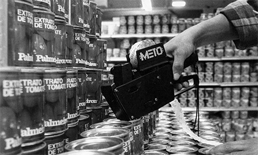
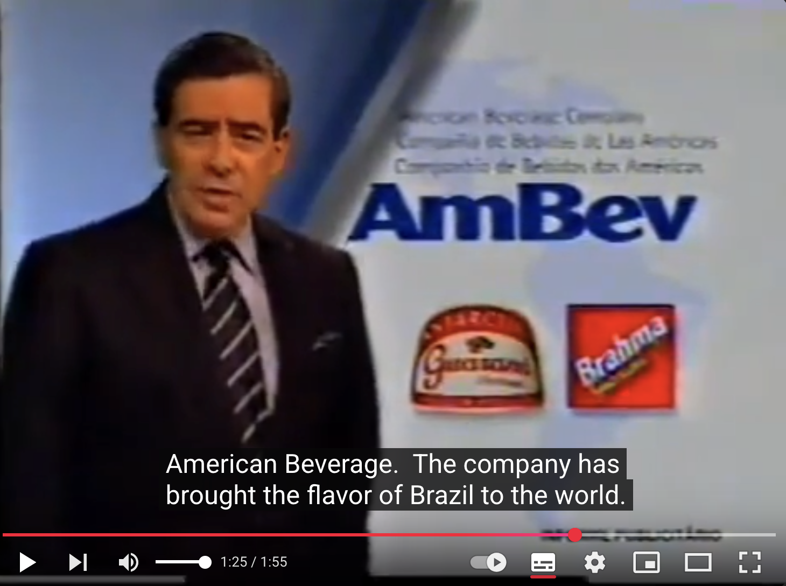

# Argument

## The argument

**Antitrust can serve as a *passive, fiscally cheap* industrial policy** --- even for a fiscally conservative, liberalizing government that explicitly denies doing industrial policy.

\vfill

- **Claim.** Brazil's flexible antitrust enforcement in the 1990s worked as *de facto* industrial policy, forging "national champions."
- **Evidence.** Two government-backed mergers: **Gerdau/Pains** (steel) and **Antarctica--Brahma → Ambev** (beer).
- **Mechanism.** **Institutional conversion** (Mahoney & Thelen 2010) of a young competition regime --- against its original intent.

## The puzzle

:::: {.columns}
::: {.column width="58%"}
> "The best industrial policy is to have no industrial policy."
> --- Pedro Malan, Minister of Finance

\vspace{1em}

Yet the same government **sponsored** the mergers that built Gerdau and Ambev.

**How pursue industrial policy while denying it?** Not through subsidies or protection, but by **reinterpreting the enforcement of competition law** --- at no cost to the Treasury.
:::
::: {.column width="42%"}
{width=90%}
:::
::::

# Antitrust & industrial policy

## Industrial policy: a working definition

> "A concerted, focused, conscious effort on the part of a government to encourage and promote a specific industry or sector with an array of policy tools that include subsidies or reduced taxes, trade protection, favorable regulation, **forced mergers**, protection from foreign takeovers." (White 2008: 8)

\vfill

Industrial policy need not be fiscal. Note the list: **favorable regulation** and **forced mergers** --- it can run *through* the regulatory apparatus.

## The received view --- and its crack

- Antitrust scholarship, from **Brandeis to Williamson**, rejects state-led industrial policy as market-distorting.
- Yet early-20th-century U.S. market regulation already worked as *de facto* industrial policy, without direct state intervention (Dobbin 1994; Prasad 2012).

\vfill

**The antitrust / industrial-policy boundary was always porous.** The question is *how* the crossing happens in a liberalizing context.

## Economization: form-based vs. effect-based

Ergen & Kohl (2019): since the 1960s, competition regimes were **economized** --- reoriented from broad societal goals to purely economic ones --- in two opposed forms.

\vspace{0.4em}
\footnotesize

| | **Form-based** (Ordoliberal) | **Effect-based** (Chicago) |
|---|---|---|
| Illegality | Of certain structures *per se* | Only if net harm is shown |
| Tools | Structural presumptions, thresholds | Rule of reason, efficiency defense |
| Remedies | Structural (divestiture) | Behavioral (conduct) |
| Discretion | **One** soft joint: market definition | **Three**: market, effects, efficiencies |

\normalsize

The two concepts bent in Brazil --- **efficiency** and **relevant market** --- are exactly the joints the effect-based approach pries open.

## Three fates of administrative discretion

Foster & Thelen (2024): the **administrative-law structure** --- how much discretion regulators hold, and *how it is disciplined* --- decides which paradigm sticks. Ergen & Kohl supply the ideas; the container decides their fate.

\vspace{0.4em}
\footnotesize

| Regime | Discretion disciplined by | Outcome |
|---|---|---|
| **Germany** | Ordoliberal **rules** (form-based profession) | Robust form-based control; blocks economization |
| **EU** | **Social learning** (deliberative administration) | Brandeisian *"regulated competition"* |
| **Brazil** | **Nothing yet** --- young regime, executive capture | **Conversion** → covert industrial policy |

\normalsize

\vfill

**Discretion is not destiny --- the *container* decides.** Brazil fills the missing cell: discretion captured *before* a profession could discipline it.

## Brazil's contribution: policy under public denial

- **Public denial is the crux.** Industrial policy pursued while disavowed at the programmatic level (Malan) --- not merely quiet, but officially rejected.
- **Denial → illegibility.** The developmental aim leaves no trace in the doctrine; it survives only in the case files --- so **process tracing** is the necessary method, not a convenience.
- **Conversion → fiscally free.** The champion is forged by *forbearance* (letting firms concentrate), not by spending. That is what "*passive*" means.
- **The irony.** The effects-based toolkit was built (Chicago) to keep the state *out*; in Brazil it let the state *in*. Conversion runs on **loud executive politics + personnel turnover** --- "covert" is *constitutive*, not cosmetic.

# Context

## Context: liberalization and runaway inflation

:::: {.columns}
::: {.column width="55%"}
- Liberalization followed decades of direct intervention: state-owned firms, protectionism, price controls and trusts.
- In a period of **runaway inflation**, stabilization (the Real Plan) made **competition a tool of inflation control** --- not a developmental one.
- Trade opening exposed domestic firms, raising fears of **denationalization**.
:::
::: {.column width="45%"}
{width=100%}
:::
::::

## A new competition authority (1994)

- The 1994 law granted autonomy to **CADE** (Administrative Council for Economic Defense); councilors appointed by the President.
- Mandate: "strengthen the competition culture" --- competition **as part of inflation control**.

\vfill

**CADE's challenge:** to legitimate a brand-new mandate --- a young regime with **no entrenched professional community** to defend it.

# Gerdau--Pains

## The rebars of discord

- Gerdau acquires Korf's Brazilian assets; the vertical-integration part is approved unanimously.
- Contention centers on the **steel rebar market** (Korf's core business), where Gerdau's share would approach **50%**.
- Under Law 8.884/94, a **20% structural threshold** still bit --- a hard, *form-based* element.

## Gerdau--Pains: timeline

- **Mar 1995** --- CADE postpones; the deal would lift Gerdau's long-steel share **39.6% → 46.2%**.
- **Oct 1995** --- **partial approval, deconstitution ordered** (46.5% of common long steel; the law bars >20%).
- **Late 1995** --- refusing compliance, Gerdau bypasses the courts and appeals to Justice Minister **Jobim**, who suspends the ruling --- *contra* Art. 50 ("no executive review").
- **Then** --- Cardoso **recomposes CADE**, replacing jurists with transaction-cost economists ("Don't cause me problems!").
- **Mar 1998** --- the reconfigured CADE approves with **10 conditions**: keep Pains, but sell the Contagem rolling unit and Transpains, rehire workers, invest US\$78M.
- **1999** --- the champion goes global: 75% of **AmeriSteel** (US).

## Gerdau: why it took brute force

- **Relevant market** --- firms: steel is a *global commodity*. CADE: domestic prices **decoupled** from world benchmarks → national market.
- **Efficiency (Art. 54)** --- firms: proprietary technology, rescue of distressed assets. CADE: achievable **without** integration; no consumer gain.

\vfill

**Only one soft joint (market definition)** → the executive had to act *against the letter of the law* (Jobim) and **replace the councilors** with transaction-cost economists ("Don't cause me problems!" --- Cardoso).

# Ambev

## The "green-and-yellow multinational"

:::: {.columns}
::: {.column width="55%"}
- After failed tie-ups with foreign firms, the two largest brewers --- **Antarctica and Brahma** --- merge into **Ambev** (1999).
- Framed as a *verde-e-amarela* champion; executives mobilized fears of **denationalization**.
- Costly domestic credit let foreign rivals **outbid** Brazilian firms --- scale at home as a defense.
:::
::: {.column width="45%"}
{width=100%}
:::
::::

## Ambev: timeline

- **Jul 1999** --- merger announced at the **Palácio da Alvorada**, with Cardoso's endorsement.
- **14 Jul 1999** --- CADE backs a pioneering **precautionary suspension**.
- **Nov 1999--Jan 2000** --- advisory bodies oppose unconditional approval; efficiencies **6.9%** vs. claimed **14.1%**.
- **Feb 2000** --- Ministry of Development affirms the **national interest**.
- **Mar 2000** --- CADE approves with a **Performance Commitment Term** (divestitures, distribution, employment).

## Ambev: the effect-based regime at work

- **Relevant market** --- Ambev: define broadly as *"beverages"*, frame rivalry as international (vs. Coca-Cola). Critics/SEAE: the market is **beer**, exports **<1%**.
- **Efficiency** --- **14.1%** claimed vs. **6.9%** found; speculative, unlikely to reach consumers.
- **CADE (Gesner Oliveira):** regulate **conduct over structure** → approved with conditions.

\vfill

The same pressure as Gerdau --- but now it **fit inside the doctrine**. No law had to be broken.

# Discussion

## Discussion

- **Gerdau (form-based, still hard):** one discretionary joint → open conflict and an *illegal* override.
- **Ambev (effect-based, installed):** three joints → the same pressure absorbed as routine.
- The sequence measures **how many discretionary joints the regime had** --- not actor fatigue.
- **Conversion = a fiscally free industrial policy** (forbearance, not spending): "passive."
- **Denial = illegibility** → detectable only by process tracing.
- **Caveat (Ergen & Kohl):** change is *piecemeal*; two cases are a precedent, not a permanent regime.

## Thank you

**Antitrust as Industrial Policy**
Government-Sponsored Mergers as Passive Industrial Policy in Brazil, 1995--2002

\vfill

André Vereta-Nahoum · andre.nahoum@usp.br
Tales Mançano · mancano.tales@usp.br

\vfill
\footnotesize University of São Paulo --- FFLCH / Department of Sociology
